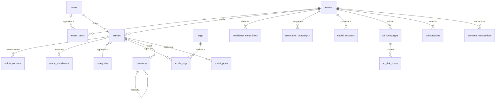

# NexusBlog SaaS — Schéma Base de Données

**Version :** 1.0  
**Date :** 2026-06-26  
**Statut :** Document de référence — validé  
**Base de données :** Neon PostgreSQL (serverless)  
**Stratégie multi-tenant :** Shared Schema + Row-Level Security (RLS)  

---

## Table des matières

1. [Vue d'ensemble et ERD](#1-vue-densemble-et-erd)
2. [Types ENUM](#2-types-enum)
3. [Tables Core — Tenants & Utilisateurs](#3-tables-core--tenants--utilisateurs)
4. [Tables Contenu](#4-tables-contenu)
5. [Tables Médias](#5-tables-médias)
6. [Tables Commentaires](#6-tables-commentaires)
7. [Tables Newsletter](#7-tables-newsletter)
8. [Tables Réseaux Sociaux](#8-tables-réseaux-sociaux)
9. [Tables Publicité](#9-tables-publicité)
10. [Tables Paiements & Facturation](#10-tables-paiements--facturation)
11. [Tables Analytics](#11-tables-analytics)
12. [Tables Système](#12-tables-système)
13. [Row-Level Security (RLS)](#13-row-level-security-rls)
14. [Index](#14-index)
15. [Fonctions et Triggers](#15-fonctions-et-triggers)
16. [Récapitulatif des tables](#16-récapitulatif-des-tables)

---

## 1. Vue d'ensemble et ERD

### Groupes fonctionnels

```
┌──────────────────────────────────────────────────────────────────┐
│                        CORE                                      │
│   tenants ──< tenant_users >── users                             │
│               user_invitations                                   │
└──────────────────────────────────────────────────────────────────┘
          │
          ├──────────────────────────────────────────────────────┐
          │                   CONTENT                            │
          │  tenants ──< articles ──< article_versions           │
          │                    ├──< article_translations         │
          │                    ├──< article_tags >── tags        │
          │                    └──  category_id ──> categories   │
          │             tenants ──< podcast_series               │
          │             tenants ──< categories                   │
          │             tenants ──< tags                         │
          └──────────────────────────────────────────────────────┘
          │
          ├──────────────────────────────────────────────────────┐
          │                   MEDIA                              │
          │  tenants ──< media                                   │
          └──────────────────────────────────────────────────────┘
          │
          ├──────────────────────────────────────────────────────┐
          │                 ENGAGEMENT                           │
          │  articles ──< comments ──< comment_reports           │
          │  tenants  ──< banned_ips                             │
          │  tenants  ──< newsletter_subscribers                 │
          │  tenants  ──< newsletter_campaigns                   │
          │  tenants  ──< push_subscriptions                     │
          │  articles ──< article_bookmarks >── users            │
          └──────────────────────────────────────────────────────┘
          │
          ├──────────────────────────────────────────────────────┐
          │               SOCIAL MEDIA                           │
          │  tenants  ──< social_accounts                        │
          │  articles ──< social_posts ──> social_accounts       │
          └──────────────────────────────────────────────────────┘
          │
          ├──────────────────────────────────────────────────────┐
          │                ADVERTISING                           │
          │  tenants  ──< ad_submissions                         │
          │  tenants  ──< ad_campaigns ──< ad_link_scans         │
          └──────────────────────────────────────────────────────┘
          │
          ├──────────────────────────────────────────────────────┐
          │                 PAYMENTS                             │
          │  tenants  ──< subscriptions                          │
          │  tenants  ──< payment_transactions                   │
          │  tenants  ──< invoices                               │
          │  articles ──< paid_content_access                    │
          └──────────────────────────────────────────────────────┘
          │
          ├──────────────────────────────────────────────────────┐
          │                ANALYTICS                             │
          │  tenants  ──< page_views (partitionné par mois)      │
          └──────────────────────────────────────────────────────┘
          │
          └──────────────────────────────────────────────────────┐
                             SYSTEM                              │
             tenants ──< custom_domains                          │
             tenants ──< redirects                               │
             tenants ──< api_keys                                │
             (global)   audit_logs                               │
             └──────────────────────────────────────────────────┘
```

### ERD simplifié (relations principales)



---

## 2. Types ENUM

```sql
-- ─────────────────────────────────────────────
-- ENUM : Rôles utilisateur
-- ─────────────────────────────────────────────
CREATE TYPE user_role AS ENUM (
    'TENANT_ADMIN',
    'EDITOR',
    'AUTHOR',
    'VIEWER'
);

-- ─────────────────────────────────────────────
-- ENUM : Plan tarifaire
-- ─────────────────────────────────────────────
CREATE TYPE plan_tier AS ENUM (
    'starter',
    'pro',
    'business',
    'enterprise'
);

-- ─────────────────────────────────────────────
-- ENUM : Statut du tenant
-- ─────────────────────────────────────────────
CREATE TYPE tenant_status AS ENUM (
    'active',
    'suspended',
    'grace_period',
    'deleted'
);

-- ─────────────────────────────────────────────
-- ENUM : Type de post
-- ─────────────────────────────────────────────
CREATE TYPE article_type AS ENUM (
    'article',
    'photo',
    'video',
    'audio',
    'podcast',
    'mixed'
);

-- ─────────────────────────────────────────────
-- ENUM : Statut de l'article
-- ─────────────────────────────────────────────
CREATE TYPE article_status AS ENUM (
    'draft',
    'in_review',
    'approved',
    'scheduled',
    'published',
    'unpublished',
    'archived'
);

-- ─────────────────────────────────────────────
-- ENUM : Visibilité de l'article
-- ─────────────────────────────────────────────
CREATE TYPE content_visibility AS ENUM (
    'public',
    'private',
    'paid'
);

-- ─────────────────────────────────────────────
-- ENUM : Statut d'un commentaire
-- ─────────────────────────────────────────────
CREATE TYPE comment_status AS ENUM (
    'pending',
    'approved',
    'rejected',
    'spam',
    'shadow_banned'
);

-- ─────────────────────────────────────────────
-- ENUM : Mode de commentaires
-- ─────────────────────────────────────────────
CREATE TYPE comments_mode AS ENUM (
    'open',
    'moderated',
    'closed'
);

-- ─────────────────────────────────────────────
-- ENUM : Statut abonné newsletter
-- ─────────────────────────────────────────────
CREATE TYPE subscriber_status AS ENUM (
    'pending',
    'active',
    'unsubscribed',
    'bounced'
);

-- ─────────────────────────────────────────────
-- ENUM : Statut campagne newsletter
-- ─────────────────────────────────────────────
CREATE TYPE campaign_status AS ENUM (
    'draft',
    'scheduled',
    'sending',
    'sent',
    'canceled'
);

-- ─────────────────────────────────────────────
-- ENUM : Plateformes sociales
-- ─────────────────────────────────────────────
CREATE TYPE social_platform AS ENUM (
    'facebook',
    'instagram',
    'linkedin',
    'twitter',
    'tiktok',
    'threads',
    'pinterest',
    'telegram',
    'whatsapp',
    'youtube_community',
    'discord',
    'reddit',
    'upscrolled'
);

-- ─────────────────────────────────────────────
-- ENUM : Statut post social
-- ─────────────────────────────────────────────
CREATE TYPE social_post_status AS ENUM (
    'pending',
    'scheduled',
    'published',
    'failed',
    'canceled'
);

-- ─────────────────────────────────────────────
-- ENUM : Statut de sécurité d'un lien
-- ─────────────────────────────────────────────
CREATE TYPE link_safety_status AS ENUM (
    'unchecked',
    'safe',
    'suspect',
    'dangerous'
);

-- ─────────────────────────────────────────────
-- ENUM : Statut campagne publicitaire
-- ─────────────────────────────────────────────
CREATE TYPE ad_campaign_status AS ENUM (
    'active',
    'paused',
    'suspended',
    'expired',
    'canceled'
);

-- ─────────────────────────────────────────────
-- ENUM : Statut soumission publicitaire
-- ─────────────────────────────────────────────
CREATE TYPE ad_submission_status AS ENUM (
    'pending',
    'approved',
    'rejected',
    'payment_pending',
    'paid',
    'expired'
);

-- ─────────────────────────────────────────────
-- ENUM : Passerelle de paiement
-- ─────────────────────────────────────────────
CREATE TYPE payment_gateway AS ENUM (
    'stripe',
    'paypal'
);

-- ─────────────────────────────────────────────
-- ENUM : Type de transaction
-- ─────────────────────────────────────────────
CREATE TYPE transaction_type AS ENUM (
    'subscription',
    'paid_article',
    'paid_newsletter',
    'ad_campaign'
);

-- ─────────────────────────────────────────────
-- ENUM : Statut de transaction
-- ─────────────────────────────────────────────
CREATE TYPE transaction_status AS ENUM (
    'pending',
    'completed',
    'failed',
    'refunded',
    'disputed'
);

-- ─────────────────────────────────────────────
-- ENUM : Statut abonnement SaaS
-- ─────────────────────────────────────────────
CREATE TYPE subscription_status AS ENUM (
    'trialing',
    'active',
    'past_due',
    'canceled',
    'unpaid',
    'paused'
);

-- ─────────────────────────────────────────────
-- ENUM : Type de média
-- ─────────────────────────────────────────────
CREATE TYPE media_type AS ENUM (
    'image',
    'video',
    'audio',
    'document'
);

-- ─────────────────────────────────────────────
-- ENUM : Statut vérification domaine
-- ─────────────────────────────────────────────
CREATE TYPE domain_verification_status AS ENUM (
    'pending',
    'verified',
    'failed'
);
```

---

## 3. Tables Core — Tenants & Utilisateurs

### `tenants`

```sql
CREATE TABLE tenants (
    id                      UUID PRIMARY KEY DEFAULT gen_random_uuid(),

    -- Identité
    name                    VARCHAR(255) NOT NULL,
    slug                    VARCHAR(50)  NOT NULL UNIQUE,  -- subdomain immuable
    description             TEXT,

    -- Apparence
    logo_url                TEXT,
    favicon_url             TEXT,
    theme                   VARCHAR(50)  NOT NULL DEFAULT 'minimal',
    primary_color           VARCHAR(7)   NOT NULL DEFAULT '#3B82F6',
    secondary_color         VARCHAR(7)   NOT NULL DEFAULT '#1E40AF',

    -- Paramètres
    language                VARCHAR(10)  NOT NULL DEFAULT 'en',
    timezone                VARCHAR(100) NOT NULL DEFAULT 'UTC',
    comments_mode           comments_mode NOT NULL DEFAULT 'moderated',
    comments_close_after_days INT,           -- NULL = jamais fermés automatiquement

    -- SEO global
    seo_title_template      VARCHAR(200) DEFAULT '{title} — {blog_name}',
    seo_meta_description    TEXT,
    robots_txt              TEXT,

    -- Intégrations analytics
    ga4_measurement_id      VARCHAR(50),
    matomo_url              TEXT,
    matomo_site_id          VARCHAR(50),
    facebook_pixel_id       VARCHAR(50),

    -- Plan & statut
    plan                    plan_tier    NOT NULL DEFAULT 'starter',
    status                  tenant_status NOT NULL DEFAULT 'active',
    trial_ends_at           TIMESTAMPTZ,
    plan_expires_at         TIMESTAMPTZ,
    grace_period_ends_at    TIMESTAMPTZ,

    -- Paiement Stripe Connect
    stripe_account_id       VARCHAR(255),
    paypal_merchant_id      VARCHAR(255),

    -- IA (Enterprise : clé propre chiffrée)
    ai_api_key_enc          TEXT,

    -- Compteurs cache (mis à jour par triggers)
    articles_count          INT NOT NULL DEFAULT 0,
    authors_count           INT NOT NULL DEFAULT 0,
    storage_used_bytes      BIGINT NOT NULL DEFAULT 0,
    subscribers_count       INT NOT NULL DEFAULT 0,
    domains_count           INT NOT NULL DEFAULT 0,

    -- Footer et réseaux sociaux
    footer_text             TEXT,
    social_links            JSONB NOT NULL DEFAULT '{}',
    -- Exemple : {"twitter":"https://x.com/...", "linkedin":"..."}

    -- Widgets sidebar
    sidebar_config          JSONB NOT NULL DEFAULT '[]',

    -- PWA
    pwa_enabled             BOOLEAN NOT NULL DEFAULT TRUE,

    created_at              TIMESTAMPTZ NOT NULL DEFAULT NOW(),
    updated_at              TIMESTAMPTZ NOT NULL DEFAULT NOW(),
    deleted_at              TIMESTAMPTZ,

    CONSTRAINT slug_format CHECK (slug ~ '^[a-z0-9][a-z0-9\-]{2,48}[a-z0-9]$')
);
```

---

### `users`

```sql
CREATE TABLE users (
    id                  UUID PRIMARY KEY DEFAULT gen_random_uuid(),

    -- Firebase
    firebase_uid        VARCHAR(128) NOT NULL UNIQUE,

    -- Profil
    email               VARCHAR(255) NOT NULL UNIQUE,
    display_name        VARCHAR(255),
    avatar_url          TEXT,
    bio                 TEXT,

    -- Plateforme
    is_super_admin      BOOLEAN NOT NULL DEFAULT FALSE,

    -- 2FA (TOTP)
    two_fa_enabled      BOOLEAN NOT NULL DEFAULT FALSE,
    two_fa_secret_enc   TEXT,             -- Secret TOTP chiffré AES-256
    two_fa_backup_codes JSONB,            -- Codes de récupération hachés

    -- Activité
    last_login_at       TIMESTAMPTZ,
    last_login_ip       INET,

    created_at          TIMESTAMPTZ NOT NULL DEFAULT NOW(),
    updated_at          TIMESTAMPTZ NOT NULL DEFAULT NOW()
);
```

---

### `tenant_users`

```sql
CREATE TABLE tenant_users (
    id          UUID PRIMARY KEY DEFAULT gen_random_uuid(),
    tenant_id   UUID NOT NULL REFERENCES tenants(id) ON DELETE CASCADE,
    user_id     UUID NOT NULL REFERENCES users(id)   ON DELETE CASCADE,

    role        user_role NOT NULL,
    invited_by  UUID REFERENCES users(id),

    joined_at   TIMESTAMPTZ NOT NULL DEFAULT NOW(),
    created_at  TIMESTAMPTZ NOT NULL DEFAULT NOW(),

    UNIQUE (tenant_id, user_id)
);
```

---

### `user_invitations`

```sql
CREATE TABLE user_invitations (
    id              UUID PRIMARY KEY DEFAULT gen_random_uuid(),
    tenant_id       UUID NOT NULL REFERENCES tenants(id) ON DELETE CASCADE,

    email           VARCHAR(255) NOT NULL,
    role            user_role    NOT NULL,
    token           VARCHAR(255) NOT NULL UNIQUE,  -- UUID signé, 1 usage

    invited_by      UUID NOT NULL REFERENCES users(id),

    expires_at      TIMESTAMPTZ NOT NULL,          -- +48h après création
    accepted_at     TIMESTAMPTZ,

    created_at      TIMESTAMPTZ NOT NULL DEFAULT NOW(),

    UNIQUE (tenant_id, email)
);
```

---

## 4. Tables Contenu

### `podcast_series`

*(Défini avant `articles` pour permettre la FK)*

```sql
CREATE TABLE podcast_series (
    id              UUID PRIMARY KEY DEFAULT gen_random_uuid(),
    tenant_id       UUID NOT NULL REFERENCES tenants(id) ON DELETE CASCADE,

    title           VARCHAR(255) NOT NULL,
    slug            VARCHAR(255) NOT NULL,
    description     TEXT,
    cover_image_url TEXT,

    -- Métadonnées RSS
    author_name     VARCHAR(255),
    author_email    VARCHAR(255),
    category        VARCHAR(100),
    language        VARCHAR(10) NOT NULL DEFAULT 'en',
    is_explicit     BOOLEAN NOT NULL DEFAULT FALSE,

    episodes_count  INT NOT NULL DEFAULT 0,

    created_at      TIMESTAMPTZ NOT NULL DEFAULT NOW(),
    updated_at      TIMESTAMPTZ NOT NULL DEFAULT NOW(),

    UNIQUE (tenant_id, slug)
);
```

---

### `categories`

```sql
CREATE TABLE categories (
    id              UUID PRIMARY KEY DEFAULT gen_random_uuid(),
    tenant_id       UUID NOT NULL REFERENCES tenants(id) ON DELETE CASCADE,

    parent_id       UUID REFERENCES categories(id) ON DELETE SET NULL,

    name            VARCHAR(100) NOT NULL,
    slug            VARCHAR(100) NOT NULL,
    description     TEXT,
    cover_image_url TEXT,

    sort_order      INT NOT NULL DEFAULT 0,
    articles_count  INT NOT NULL DEFAULT 0,

    created_at      TIMESTAMPTZ NOT NULL DEFAULT NOW(),
    updated_at      TIMESTAMPTZ NOT NULL DEFAULT NOW(),

    UNIQUE (tenant_id, slug),
    -- Empêche les cycles de parenté (max 2 niveaux géré applicativement)
    CONSTRAINT no_self_parent CHECK (parent_id <> id)
);
```

---

### `tags`

```sql
CREATE TABLE tags (
    id              UUID PRIMARY KEY DEFAULT gen_random_uuid(),
    tenant_id       UUID NOT NULL REFERENCES tenants(id) ON DELETE CASCADE,

    name            VARCHAR(100) NOT NULL,
    slug            VARCHAR(100) NOT NULL,
    articles_count  INT NOT NULL DEFAULT 0,

    created_at      TIMESTAMPTZ NOT NULL DEFAULT NOW(),

    UNIQUE (tenant_id, slug)
);
```

---

### `articles`

```sql
CREATE TABLE articles (
    id                      UUID PRIMARY KEY DEFAULT gen_random_uuid(),
    tenant_id               UUID NOT NULL REFERENCES tenants(id) ON DELETE CASCADE,
    author_id               UUID NOT NULL REFERENCES users(id),

    -- Type et contenu
    type                    article_type NOT NULL DEFAULT 'article',
    title                   VARCHAR(500) NOT NULL,
    slug                    VARCHAR(500) NOT NULL,
    excerpt                 VARCHAR(500),
    content                 JSONB NOT NULL DEFAULT '{}',  -- Tiptap JSON
    content_text            TEXT,   -- Texte brut extrait (pour Elasticsearch)
    word_count              INT,
    reading_time_minutes    INT,

    -- Médias associés
    featured_image_url      TEXT,   -- URL Cloudinary directe
    featured_image_alt      TEXT,

    -- Champs spécifiques vidéo embed
    video_embed_url         TEXT,
    video_platform          VARCHAR(30),
    -- Ex : youtube, vimeo, tiktok, instagram, facebook, dailymotion

    -- Champs spécifiques audio / podcast
    audio_url               TEXT,   -- URL Cloudinary
    audio_duration_seconds  INT,
    podcast_series_id       UUID REFERENCES podcast_series(id) ON DELETE SET NULL,
    podcast_episode         INT,
    podcast_season          INT     NOT NULL DEFAULT 1,
    podcast_transcript      TEXT,   -- Transcription Whisper

    -- Organisation
    category_id             UUID REFERENCES categories(id) ON DELETE SET NULL,

    -- Workflow
    status                  article_status NOT NULL DEFAULT 'draft',
    visibility              content_visibility NOT NULL DEFAULT 'public',

    -- Publication
    published_at            TIMESTAMPTZ,
    scheduled_at            TIMESTAMPTZ,
    unpublished_at          TIMESTAMPTZ,

    -- Approbation
    submitted_for_review_at TIMESTAMPTZ,
    reviewed_by             UUID REFERENCES users(id),
    reviewed_at             TIMESTAMPTZ,
    review_comment          TEXT,

    -- SEO
    meta_title              VARCHAR(200),
    meta_description        VARCHAR(300),
    og_image_url            TEXT,
    canonical_url           TEXT,
    robots                  VARCHAR(100) NOT NULL DEFAULT 'index,follow',
    schema_type             VARCHAR(50)  NOT NULL DEFAULT 'Article',

    -- Langue
    language                VARCHAR(10)  NOT NULL DEFAULT 'en',

    -- Monétisation
    price_usd               DECIMAL(10,2),
    -- Non-null uniquement si visibility = 'paid'

    -- IA
    ai_summary              TEXT,
    ai_suggested_tags       JSONB,  -- ["tag1","tag2"]

    -- Versionnage
    version_number          INT NOT NULL DEFAULT 1,
    current_version_id      UUID,  -- Mis à jour après chaque save manuel

    -- Compteurs (mis à jour par triggers)
    views_count             INT NOT NULL DEFAULT 0,
    comments_count          INT NOT NULL DEFAULT 0,
    bookmarks_count         INT NOT NULL DEFAULT 0,

    created_at              TIMESTAMPTZ NOT NULL DEFAULT NOW(),
    updated_at              TIMESTAMPTZ NOT NULL DEFAULT NOW(),
    deleted_at              TIMESTAMPTZ,

    UNIQUE (tenant_id, slug),

    CONSTRAINT paid_needs_price CHECK (
        visibility <> 'paid' OR price_usd IS NOT NULL
    ),
    CONSTRAINT price_minimum CHECK (
        price_usd IS NULL OR price_usd >= 0.50
    ),
    CONSTRAINT podcast_needs_series CHECK (
        type <> 'podcast' OR podcast_series_id IS NOT NULL
    )
);
```

---

### `article_tags` *(table de jointure)*

```sql
CREATE TABLE article_tags (
    article_id  UUID NOT NULL REFERENCES articles(id) ON DELETE CASCADE,
    tag_id      UUID NOT NULL REFERENCES tags(id)     ON DELETE CASCADE,
    tenant_id   UUID NOT NULL,

    PRIMARY KEY (article_id, tag_id)
);
```

---

### `article_versions`

```sql
CREATE TABLE article_versions (
    id              UUID PRIMARY KEY DEFAULT gen_random_uuid(),
    article_id      UUID NOT NULL REFERENCES articles(id) ON DELETE CASCADE,
    tenant_id       UUID NOT NULL,

    version_number  INT  NOT NULL,
    title           VARCHAR(500) NOT NULL,
    content         JSONB NOT NULL,
    excerpt         VARCHAR(500),
    word_count      INT,

    created_by      UUID NOT NULL REFERENCES users(id),
    created_at      TIMESTAMPTZ NOT NULL DEFAULT NOW(),

    UNIQUE (article_id, version_number)
);
-- Rétention : 30 versions max par article (nettoyage via cron)
```

---

### `article_translations`

```sql
CREATE TABLE article_translations (
    id              UUID PRIMARY KEY DEFAULT gen_random_uuid(),
    article_id      UUID NOT NULL REFERENCES articles(id) ON DELETE CASCADE,
    tenant_id       UUID NOT NULL,

    language        VARCHAR(10) NOT NULL,  -- BCP 47 : fr, ar, zh-CN

    -- Contenu traduit
    title           TEXT NOT NULL,
    excerpt         TEXT,
    content         JSONB NOT NULL,
    content_text    TEXT,

    -- SEO traduit
    meta_title      VARCHAR(200),
    meta_description VARCHAR(300),
    slug            VARCHAR(500),

    -- Source
    is_auto         BOOLEAN NOT NULL DEFAULT TRUE,
    -- TRUE = IA, FALSE = traduction manuelle par l'auteur

    translated_at   TIMESTAMPTZ NOT NULL DEFAULT NOW(),
    updated_at      TIMESTAMPTZ NOT NULL DEFAULT NOW(),

    UNIQUE (article_id, language)
);
```

---

### `article_bookmarks`

```sql
CREATE TABLE article_bookmarks (
    id          UUID PRIMARY KEY DEFAULT gen_random_uuid(),
    tenant_id   UUID NOT NULL,
    article_id  UUID NOT NULL REFERENCES articles(id) ON DELETE CASCADE,
    user_id     UUID NOT NULL REFERENCES users(id)    ON DELETE CASCADE,

    created_at  TIMESTAMPTZ NOT NULL DEFAULT NOW(),

    UNIQUE (article_id, user_id)
);
```

---

## 5. Tables Médias

### `media`

```sql
CREATE TABLE media (
    id                  UUID PRIMARY KEY DEFAULT gen_random_uuid(),
    tenant_id           UUID NOT NULL REFERENCES tenants(id) ON DELETE CASCADE,
    uploaded_by         UUID NOT NULL REFERENCES users(id),

    -- Fichier
    name                VARCHAR(255) NOT NULL,
    original_name       VARCHAR(255) NOT NULL,
    type                media_type   NOT NULL,
    mime_type           VARCHAR(100) NOT NULL,
    size_bytes          BIGINT NOT NULL,

    -- Cloudinary
    cloudinary_public_id VARCHAR(500) NOT NULL,
    cloudinary_url       TEXT NOT NULL,
    cloudinary_folder    TEXT,

    -- Dimensions
    width               INT,
    height              INT,
    duration_seconds    INT,   -- Vidéos et audio

    -- IA
    alt_text            TEXT,   -- Généré par OpenAI Vision
    ai_tags             JSONB,  -- ["nature","outdoor","sunset"]

    -- Sécurité
    is_safe             BOOLEAN NOT NULL DEFAULT TRUE,

    -- Usage
    usage_count         INT NOT NULL DEFAULT 0,
    -- Incrémenté quand utilisé dans un article

    created_at          TIMESTAMPTZ NOT NULL DEFAULT NOW(),
    updated_at          TIMESTAMPTZ NOT NULL DEFAULT NOW(),
    deleted_at          TIMESTAMPTZ
);
```

---

## 6. Tables Commentaires

### `comments`

```sql
CREATE TABLE comments (
    id              UUID PRIMARY KEY DEFAULT gen_random_uuid(),
    tenant_id       UUID NOT NULL REFERENCES tenants(id)  ON DELETE CASCADE,
    article_id      UUID NOT NULL REFERENCES articles(id) ON DELETE CASCADE,
    parent_id       UUID REFERENCES comments(id)          ON DELETE CASCADE,
    -- parent_id non-null = réponse à un commentaire

    -- Auteur (authentifié ou invité)
    user_id         UUID REFERENCES users(id) ON DELETE SET NULL,
    guest_name      VARCHAR(100),
    guest_email     VARCHAR(255),

    -- Contenu
    content         TEXT NOT NULL,
    image_url       TEXT,  -- URL Cloudinary si image jointe

    -- Modération
    status          comment_status NOT NULL DEFAULT 'pending',
    ai_risk_score   SMALLINT,  -- 0-100
    ai_risk_reasons JSONB,
    -- Ex: {"toxicity":0.85,"spam":0.12,"hate_speech":0.03}

    is_shadow_banned BOOLEAN NOT NULL DEFAULT FALSE,

    -- Tracking
    ip_address      INET,
    user_agent      TEXT,

    -- Compteurs
    replies_count   INT NOT NULL DEFAULT 0,

    created_at      TIMESTAMPTZ NOT NULL DEFAULT NOW(),
    updated_at      TIMESTAMPTZ NOT NULL DEFAULT NOW(),
    deleted_at      TIMESTAMPTZ,

    CONSTRAINT guest_needs_name_email CHECK (
        user_id IS NOT NULL
        OR (guest_name IS NOT NULL AND guest_email IS NOT NULL)
    ),
    CONSTRAINT content_not_empty CHECK (LENGTH(TRIM(content)) > 0),
    CONSTRAINT max_depth CHECK (parent_id IS NULL OR (
        SELECT parent_id FROM comments c2 WHERE c2.id = parent_id
    ) IS NULL)
    -- Imbrication max 1 niveau (les réponses ne peuvent pas être répondues)
);
```

---

### `comment_reports`

```sql
CREATE TABLE comment_reports (
    id              UUID PRIMARY KEY DEFAULT gen_random_uuid(),
    tenant_id       UUID NOT NULL,
    comment_id      UUID NOT NULL REFERENCES comments(id) ON DELETE CASCADE,

    reported_by     UUID REFERENCES users(id),
    reporter_ip     INET,

    reason          VARCHAR(50) NOT NULL,
    -- spam, harassment, hate_speech, inappropriate, misinformation, other
    description     TEXT,

    status          VARCHAR(20) NOT NULL DEFAULT 'pending',
    -- pending, reviewed, dismissed
    reviewed_by     UUID REFERENCES users(id),
    reviewed_at     TIMESTAMPTZ,

    created_at      TIMESTAMPTZ NOT NULL DEFAULT NOW()
);
```

---

### `banned_ips`

```sql
CREATE TABLE banned_ips (
    id          UUID PRIMARY KEY DEFAULT gen_random_uuid(),
    tenant_id   UUID NOT NULL REFERENCES tenants(id) ON DELETE CASCADE,

    ip_address  INET NOT NULL,
    reason      TEXT,
    banned_by   UUID NOT NULL REFERENCES users(id),

    expires_at  TIMESTAMPTZ,  -- NULL = ban permanent

    created_at  TIMESTAMPTZ NOT NULL DEFAULT NOW(),

    UNIQUE (tenant_id, ip_address)
);
```

---

## 7. Tables Newsletter

### `newsletter_subscribers`

```sql
CREATE TABLE newsletter_subscribers (
    id                          UUID PRIMARY KEY DEFAULT gen_random_uuid(),
    tenant_id                   UUID NOT NULL REFERENCES tenants(id) ON DELETE CASCADE,

    email                       VARCHAR(255) NOT NULL,
    first_name                  VARCHAR(100),

    -- Statut et conformité RGPD
    status                      subscriber_status NOT NULL DEFAULT 'pending',

    confirmation_token          VARCHAR(255) UNIQUE,
    confirmation_token_expires_at TIMESTAMPTZ,
    confirmed_at                TIMESTAMPTZ,

    subscribed_ip               INET,
    subscribed_source           VARCHAR(100),
    -- widget_inline, popup, footer, sidebar, api, import

    -- Désabonnement
    unsubscribe_token           VARCHAR(255) NOT NULL UNIQUE
                                DEFAULT encode(gen_random_bytes(32), 'hex'),
    unsubscribed_at             TIMESTAMPTZ,

    -- Abonnement payant
    is_paid_subscriber          BOOLEAN NOT NULL DEFAULT FALSE,
    paid_subscription_expires_at TIMESTAMPTZ,

    -- Statistiques
    emails_received             INT NOT NULL DEFAULT 0,
    emails_opened               INT NOT NULL DEFAULT 0,
    emails_clicked              INT NOT NULL DEFAULT 0,
    last_opened_at              TIMESTAMPTZ,

    created_at                  TIMESTAMPTZ NOT NULL DEFAULT NOW(),
    updated_at                  TIMESTAMPTZ NOT NULL DEFAULT NOW(),

    UNIQUE (tenant_id, email)
);
```

---

### `newsletter_campaigns`

```sql
CREATE TABLE newsletter_campaigns (
    id              UUID PRIMARY KEY DEFAULT gen_random_uuid(),
    tenant_id       UUID NOT NULL REFERENCES tenants(id) ON DELETE CASCADE,

    -- Contenu
    subject         VARCHAR(255) NOT NULL,
    preview_text    VARCHAR(150),
    content_html    TEXT,
    content_json    JSONB,

    -- Expéditeur
    from_name       VARCHAR(100),
    from_email      VARCHAR(255),

    -- Statut
    status          campaign_status NOT NULL DEFAULT 'draft',

    -- Envoi
    scheduled_at    TIMESTAMPTZ,
    started_at      TIMESTAMPTZ,
    sent_at         TIMESTAMPTZ,

    -- Statistiques
    recipients_count    INT NOT NULL DEFAULT 0,
    sent_count          INT NOT NULL DEFAULT 0,
    delivered_count     INT NOT NULL DEFAULT 0,
    opened_count        INT NOT NULL DEFAULT 0,
    clicked_count       INT NOT NULL DEFAULT 0,
    bounced_count       INT NOT NULL DEFAULT 0,
    unsubscribed_count  INT NOT NULL DEFAULT 0,

    -- Source
    source_article_id   UUID REFERENCES articles(id) ON DELETE SET NULL,

    created_by      UUID NOT NULL REFERENCES users(id),
    created_at      TIMESTAMPTZ NOT NULL DEFAULT NOW(),
    updated_at      TIMESTAMPTZ NOT NULL DEFAULT NOW()
);
```

---

### `newsletter_sends`

*(Log individuel par destinataire — essentiel pour le suivi open/click)*

```sql
CREATE TABLE newsletter_sends (
    id              UUID PRIMARY KEY DEFAULT gen_random_uuid(),
    tenant_id       UUID NOT NULL,
    campaign_id     UUID NOT NULL REFERENCES newsletter_campaigns(id) ON DELETE CASCADE,
    subscriber_id   UUID NOT NULL REFERENCES newsletter_subscribers(id) ON DELETE CASCADE,

    status          VARCHAR(20) NOT NULL DEFAULT 'sent',
    -- sent, delivered, opened, clicked, bounced, failed

    opened_at       TIMESTAMPTZ,
    clicked_at      TIMESTAMPTZ,
    bounced_at      TIMESTAMPTZ,
    bounce_reason   TEXT,

    -- Tracking pixel URL unique par send
    tracking_id     VARCHAR(255) NOT NULL UNIQUE
                    DEFAULT encode(gen_random_bytes(16), 'hex'),

    sent_at         TIMESTAMPTZ NOT NULL DEFAULT NOW()
)
PARTITION BY RANGE (sent_at);
-- Partitionné par mois pour performance à grande échelle
```

---

## 8. Tables Réseaux Sociaux

### `social_accounts`

```sql
CREATE TABLE social_accounts (
    id                      UUID PRIMARY KEY DEFAULT gen_random_uuid(),
    tenant_id               UUID NOT NULL REFERENCES tenants(id) ON DELETE CASCADE,

    platform                social_platform NOT NULL,

    -- OAuth (chiffrés AES-256 en base)
    access_token_enc        TEXT,
    refresh_token_enc       TEXT,
    token_expires_at        TIMESTAMPTZ,

    -- Identifiants plateforme
    platform_account_id     VARCHAR(255),
    platform_account_name   VARCHAR(255),
    platform_account_url    TEXT,

    -- Configuration
    is_active               BOOLEAN NOT NULL DEFAULT TRUE,
    auto_post               BOOLEAN NOT NULL DEFAULT TRUE,
    post_delay_minutes      INT NOT NULL DEFAULT 0,
    caption_template        TEXT,
    -- Variables : {title}, {url}, {excerpt}, {hashtags}

    -- Statistiques
    posts_count             INT NOT NULL DEFAULT 0,
    last_posted_at          TIMESTAMPTZ,

    connected_by            UUID NOT NULL REFERENCES users(id),
    created_at              TIMESTAMPTZ NOT NULL DEFAULT NOW(),
    updated_at              TIMESTAMPTZ NOT NULL DEFAULT NOW(),

    UNIQUE (tenant_id, platform)
);
```

---

### `social_posts`

```sql
CREATE TABLE social_posts (
    id                  UUID PRIMARY KEY DEFAULT gen_random_uuid(),
    tenant_id           UUID NOT NULL,
    article_id          UUID NOT NULL REFERENCES articles(id) ON DELETE CASCADE,
    social_account_id   UUID NOT NULL REFERENCES social_accounts(id),

    platform            social_platform NOT NULL,

    -- Contenu généré
    caption             TEXT,
    hashtags            JSONB,  -- ["tech","saas","blogging"]
    thumbnail_url       TEXT,
    link_with_utm       TEXT,

    -- Statut
    status              social_post_status NOT NULL DEFAULT 'pending',

    -- Planification
    scheduled_at        TIMESTAMPTZ,
    published_at        TIMESTAMPTZ,

    -- Réponse plateforme
    platform_post_id    VARCHAR(255),
    platform_post_url   TEXT,
    error_message       TEXT,
    retry_count         SMALLINT NOT NULL DEFAULT 0,
    next_retry_at       TIMESTAMPTZ,

    created_at          TIMESTAMPTZ NOT NULL DEFAULT NOW(),
    updated_at          TIMESTAMPTZ NOT NULL DEFAULT NOW()
);
```

---

## 9. Tables Publicité

### `ad_submissions`

```sql
CREATE TABLE ad_submissions (
    id                          UUID PRIMARY KEY DEFAULT gen_random_uuid(),
    tenant_id                   UUID NOT NULL REFERENCES tenants(id) ON DELETE CASCADE,

    -- Annonceur
    email                       VARCHAR(255) NOT NULL,
    business_name               VARCHAR(255) NOT NULL,
    phone                       VARCHAR(50),

    -- Contenu publicitaire
    image_url                   TEXT,  -- URL Cloudinary après traitement
    ad_text                     VARCHAR(150),
    destination_url             TEXT,
    -- NULL = bannière sans lien ; non-null = lien cliquable

    -- Budget et durée
    budget_usd                  DECIMAL(10,2) NOT NULL,
    duration_days               INT NOT NULL,
    message                     TEXT,

    -- Statut
    status                      ad_submission_status NOT NULL DEFAULT 'pending',

    -- Revue admin
    reviewed_by                 UUID REFERENCES users(id),
    reviewed_at                 TIMESTAMPTZ,
    rejection_reason            TEXT,

    -- Paiement
    payment_link                TEXT,
    payment_link_expires_at     TIMESTAMPTZ,
    payment_gateway             payment_gateway,
    gateway_payment_id          VARCHAR(255),

    created_at                  TIMESTAMPTZ NOT NULL DEFAULT NOW(),
    updated_at                  TIMESTAMPTZ NOT NULL DEFAULT NOW(),

    CONSTRAINT budget_minimum CHECK (budget_usd >= 10.00),
    CONSTRAINT valid_url CHECK (
        destination_url IS NULL
        OR destination_url LIKE 'https://%'
    )
);
```

---

### `ad_campaigns`

```sql
CREATE TABLE ad_campaigns (
    id              UUID PRIMARY KEY DEFAULT gen_random_uuid(),
    tenant_id       UUID NOT NULL REFERENCES tenants(id) ON DELETE CASCADE,
    submission_id   UUID REFERENCES ad_submissions(id)   ON DELETE SET NULL,

    -- Contenu
    image_url       TEXT NOT NULL,
    ad_text         VARCHAR(150),
    destination_url TEXT,
    -- NULL = display-only ; non-null = lien cliquable

    -- Rotation pondérée
    budget_usd      DECIMAL(10,2) NOT NULL,
    weight          INT NOT NULL DEFAULT 1,
    -- weight = ROUND((budget_usd / total_budget_all_active) * 1000)
    -- Recalculé par un trigger à chaque INSERT/UPDATE

    -- Planning
    starts_at       TIMESTAMPTZ NOT NULL,
    ends_at         TIMESTAMPTZ NOT NULL,

    -- Statut et sécurité
    status          ad_campaign_status NOT NULL DEFAULT 'active',
    link_safety_status link_safety_status NOT NULL DEFAULT 'unchecked',
    last_scanned_at TIMESTAMPTZ,

    -- Statistiques
    impressions_count   INT NOT NULL DEFAULT 0,
    clicks_count        INT NOT NULL DEFAULT 0,

    -- Paiement
    transaction_id  UUID,  -- FK ajoutée après création de payment_transactions

    created_at      TIMESTAMPTZ NOT NULL DEFAULT NOW(),
    updated_at      TIMESTAMPTZ NOT NULL DEFAULT NOW(),

    CONSTRAINT end_after_start CHECK (ends_at > starts_at),
    CONSTRAINT valid_destination CHECK (
        destination_url IS NULL
        OR destination_url LIKE 'https://%'
    )
);
```

---

### `ad_link_scans`

```sql
CREATE TABLE ad_link_scans (
    id                      UUID PRIMARY KEY DEFAULT gen_random_uuid(),
    campaign_id             UUID NOT NULL REFERENCES ad_campaigns(id) ON DELETE CASCADE,
    tenant_id               UUID NOT NULL,

    url                     TEXT NOT NULL,

    -- Résultats par source
    google_safebrowsing     VARCHAR(20),  -- safe / unsafe / error
    virustotal_positives    INT,          -- Nombre de moteurs AV qui ont détecté
    virustotal_total        INT,
    urlhaus_status          VARCHAR(20),  -- clean / malware / error
    phishtank_status        VARCHAR(20),  -- clean / phishing / error

    -- Résultat global
    overall_status          link_safety_status NOT NULL DEFAULT 'safe',

    scanned_at              TIMESTAMPTZ NOT NULL DEFAULT NOW()
);
-- Index partiel pour les scans récents (les plus consultés)
```

---

## 10. Tables Paiements & Facturation

### `subscriptions`

```sql
CREATE TABLE subscriptions (
    id                          UUID PRIMARY KEY DEFAULT gen_random_uuid(),
    tenant_id                   UUID NOT NULL REFERENCES tenants(id) ON DELETE CASCADE,

    plan                        plan_tier NOT NULL,
    status                      subscription_status NOT NULL DEFAULT 'trialing',
    billing_period              VARCHAR(10) NOT NULL DEFAULT 'monthly',
    -- monthly, annual

    price_usd                   DECIMAL(10,2) NOT NULL,

    -- Passerelle
    gateway                     payment_gateway NOT NULL,
    gateway_subscription_id     VARCHAR(255) UNIQUE,
    gateway_customer_id         VARCHAR(255),

    -- Dates
    trial_ends_at               TIMESTAMPTZ,
    current_period_starts_at    TIMESTAMPTZ NOT NULL,
    current_period_ends_at      TIMESTAMPTZ NOT NULL,
    canceled_at                 TIMESTAMPTZ,
    cancel_at_period_end        BOOLEAN NOT NULL DEFAULT FALSE,

    created_at                  TIMESTAMPTZ NOT NULL DEFAULT NOW(),
    updated_at                  TIMESTAMPTZ NOT NULL DEFAULT NOW()
);
```

---

### `invoices`

```sql
CREATE TABLE invoices (
    id              UUID PRIMARY KEY DEFAULT gen_random_uuid(),
    tenant_id       UUID NOT NULL,

    -- Numérotation
    invoice_number  VARCHAR(50) NOT NULL UNIQUE,
    -- Format : INV-2026-00001 (séquence globale par tenant)

    -- Destinataire
    recipient_name  VARCHAR(255),
    recipient_email VARCHAR(255) NOT NULL,
    recipient_address TEXT,
    recipient_vat_number VARCHAR(50),

    -- Montants
    subtotal_usd    DECIMAL(10,2) NOT NULL,
    tax_rate        DECIMAL(5,2)  NOT NULL DEFAULT 0,
    tax_usd         DECIMAL(10,2) NOT NULL DEFAULT 0,
    total_usd       DECIMAL(10,2) NOT NULL,
    currency        VARCHAR(3)    NOT NULL DEFAULT 'USD',

    -- Lignes de facturation
    line_items      JSONB NOT NULL,
    -- [{"description":"Plan Pro - Juin 2026","qty":1,"unit_price":9.00,"total":9.00}]

    -- Statut
    status          VARCHAR(20) NOT NULL DEFAULT 'paid',
    -- draft, sent, paid, void

    -- PDF
    pdf_url         TEXT,

    issued_at       TIMESTAMPTZ NOT NULL DEFAULT NOW(),
    due_at          TIMESTAMPTZ,
    paid_at         TIMESTAMPTZ
);
```

---

### `payment_transactions`

```sql
CREATE TABLE payment_transactions (
    id                          UUID PRIMARY KEY DEFAULT gen_random_uuid(),
    tenant_id                   UUID NOT NULL,

    type                        transaction_type NOT NULL,

    -- Montants
    gross_amount_usd            DECIMAL(10,2) NOT NULL,
    platform_fee_usd            DECIMAL(10,2) NOT NULL DEFAULT 0,
    -- 5% sur paid_article et paid_newsletter
    net_amount_usd              DECIMAL(10,2) NOT NULL,
    currency                    VARCHAR(3) NOT NULL DEFAULT 'USD',

    -- Passerelle
    gateway                     payment_gateway NOT NULL,
    gateway_transaction_id      VARCHAR(255) UNIQUE,
    gateway_payment_intent_id   VARCHAR(255),
    gateway_charge_id           VARCHAR(255),

    -- Payeur
    payer_email                 VARCHAR(255),
    payer_name                  VARCHAR(255),

    -- Statut
    status                      transaction_status NOT NULL DEFAULT 'pending',

    -- Références croisées
    subscription_id             UUID REFERENCES subscriptions(id)    ON DELETE SET NULL,
    article_id                  UUID REFERENCES articles(id)         ON DELETE SET NULL,
    ad_campaign_id              UUID REFERENCES ad_campaigns(id)     ON DELETE SET NULL,
    invoice_id                  UUID REFERENCES invoices(id)         ON DELETE SET NULL,

    metadata                    JSONB,
    -- Données brutes du webhook gateway pour audit

    created_at                  TIMESTAMPTZ NOT NULL DEFAULT NOW(),
    updated_at                  TIMESTAMPTZ NOT NULL DEFAULT NOW()
);
```

---

### `paid_content_access`

```sql
CREATE TABLE paid_content_access (
    id                          UUID PRIMARY KEY DEFAULT gen_random_uuid(),
    tenant_id                   UUID NOT NULL,

    -- Contenu accessible
    article_id                  UUID REFERENCES articles(id) ON DELETE CASCADE,

    -- Acheteur
    user_id                     UUID REFERENCES users(id)  ON DELETE SET NULL,
    email                       VARCHAR(255) NOT NULL,

    -- Paiement
    transaction_id              UUID NOT NULL REFERENCES payment_transactions(id),

    -- Accès
    granted_at                  TIMESTAMPTZ NOT NULL DEFAULT NOW(),
    expires_at                  TIMESTAMPTZ,  -- NULL = accès à vie

    UNIQUE (article_id, email)
);
```

---

## 11. Tables Analytics

### `page_views`

```sql
CREATE TABLE page_views (
    id                      UUID NOT NULL DEFAULT gen_random_uuid(),
    tenant_id               UUID NOT NULL,
    article_id              UUID,  -- NULL si page hors article (home, catégorie)

    path                    TEXT NOT NULL,

    -- Attribution
    referrer                TEXT,
    utm_source              VARCHAR(100),
    utm_medium              VARCHAR(100),
    utm_campaign            VARCHAR(100),

    -- Visiteur (anonymisé RGPD)
    visitor_id              VARCHAR(64),
    -- Fingerprint anonyme (ne stocke pas IP complète)
    user_id                 UUID,
    -- Stocké uniquement si l'utilisateur est connecté

    -- Géolocalisation (depuis IP — IP non stockée)
    country_code            VARCHAR(2),
    city                    VARCHAR(100),

    -- Appareil
    device_type             VARCHAR(20),  -- desktop, mobile, tablet
    browser                 VARCHAR(50),
    os                      VARCHAR(50),

    -- Engagement
    session_duration_seconds INT,
    scroll_depth_percent     SMALLINT,  -- 0-100

    created_at              TIMESTAMPTZ NOT NULL DEFAULT NOW(),

    PRIMARY KEY (id, created_at)
)
PARTITION BY RANGE (created_at);

-- Partitions mensuelles créées automatiquement
CREATE TABLE page_views_2026_06
    PARTITION OF page_views
    FOR VALUES FROM ('2026-06-01') TO ('2026-07-01');
-- etc.
```

---

## 12. Tables Système

### `custom_domains`

```sql
CREATE TABLE custom_domains (
    id                      UUID PRIMARY KEY DEFAULT gen_random_uuid(),
    tenant_id               UUID NOT NULL REFERENCES tenants(id) ON DELETE CASCADE,

    domain                  VARCHAR(255) NOT NULL UNIQUE,
    is_primary              BOOLEAN NOT NULL DEFAULT TRUE,

    -- Vérification DNS
    verification_status     domain_verification_status NOT NULL DEFAULT 'pending',
    cname_target            TEXT,
    -- La valeur CNAME que l'annonceur doit créer
    verified_at             TIMESTAMPTZ,
    last_check_at           TIMESTAMPTZ,

    -- SSL (Let's Encrypt)
    ssl_status              VARCHAR(20) NOT NULL DEFAULT 'pending',
    -- pending, provisioning, active, expired, failed
    ssl_expires_at          TIMESTAMPTZ,
    ssl_renewed_at          TIMESTAMPTZ,

    created_at              TIMESTAMPTZ NOT NULL DEFAULT NOW(),
    updated_at              TIMESTAMPTZ NOT NULL DEFAULT NOW()
);
```

---

### `redirects`

```sql
CREATE TABLE redirects (
    id          UUID PRIMARY KEY DEFAULT gen_random_uuid(),
    tenant_id   UUID NOT NULL REFERENCES tenants(id) ON DELETE CASCADE,

    from_path   TEXT NOT NULL,
    to_path     TEXT NOT NULL,
    type        SMALLINT NOT NULL DEFAULT 301,
    -- 301 (permanent) ou 302 (temporaire)

    hits_count  INT NOT NULL DEFAULT 0,

    created_at  TIMESTAMPTZ NOT NULL DEFAULT NOW(),

    UNIQUE (tenant_id, from_path),
    CONSTRAINT valid_redirect_type CHECK (type IN (301, 302))
);
```

---

### `push_subscriptions`

```sql
CREATE TABLE push_subscriptions (
    id          UUID PRIMARY KEY DEFAULT gen_random_uuid(),
    tenant_id   UUID NOT NULL REFERENCES tenants(id) ON DELETE CASCADE,

    fcm_token   TEXT NOT NULL,
    user_id     UUID REFERENCES users(id) ON DELETE SET NULL,

    -- Préférences (NULL = toutes catégories)
    category_ids JSONB,

    -- Appareil
    browser     VARCHAR(50),
    device_type VARCHAR(20),

    is_active   BOOLEAN NOT NULL DEFAULT TRUE,

    created_at  TIMESTAMPTZ NOT NULL DEFAULT NOW(),
    last_used_at TIMESTAMPTZ NOT NULL DEFAULT NOW(),

    UNIQUE (tenant_id, fcm_token)
);
```

---

### `api_keys`

```sql
CREATE TABLE api_keys (
    id                  UUID PRIMARY KEY DEFAULT gen_random_uuid(),
    tenant_id           UUID NOT NULL REFERENCES tenants(id) ON DELETE CASCADE,

    name                VARCHAR(100) NOT NULL,

    -- Sécurité : jamais la clé en clair
    key_hash            VARCHAR(64) NOT NULL UNIQUE,
    -- SHA-256 hex de la clé réelle (nbk_...)
    key_prefix          VARCHAR(12) NOT NULL,
    -- Premiers caractères affichés dans l'UI (nbk_xxxx...)

    -- Permissions
    scopes              JSONB NOT NULL DEFAULT '["read"]',
    -- ["read"], ["read","write"]

    -- Rate limiting
    requests_this_month INT NOT NULL DEFAULT 0,
    month_resets_at     TIMESTAMPTZ,

    -- Statut
    is_active           BOOLEAN NOT NULL DEFAULT TRUE,
    last_used_at        TIMESTAMPTZ,

    created_by          UUID NOT NULL REFERENCES users(id),
    expires_at          TIMESTAMPTZ,

    created_at          TIMESTAMPTZ NOT NULL DEFAULT NOW()
);
```

---

### `audit_logs`

```sql
CREATE TABLE audit_logs (
    id                  UUID NOT NULL DEFAULT gen_random_uuid(),

    -- Acteur
    user_id             UUID,
    user_email          VARCHAR(255),
    is_super_admin      BOOLEAN NOT NULL DEFAULT FALSE,

    -- Action
    action              VARCHAR(100) NOT NULL,
    -- Ex : article.publish, tenant.suspend, user.role_change, ad.approve
    resource_type       VARCHAR(50),
    resource_id         UUID,

    -- Contexte
    tenant_id           UUID,
    target_tenant_id    UUID,
    -- Renseigné quand un Super Admin accède à un tenant

    -- Données
    old_value           JSONB,
    new_value           JSONB,
    reason              TEXT,
    -- Obligatoire pour les accès Super Admin cross-tenant

    -- Requête
    ip_address          INET,
    user_agent          TEXT,
    trace_id            VARCHAR(100),

    created_at          TIMESTAMPTZ NOT NULL DEFAULT NOW(),

    PRIMARY KEY (id, created_at)
)
PARTITION BY RANGE (created_at);
-- Partitions mensuelles
-- Rétention : 90 jours (cron de nettoyage)

CREATE TABLE audit_logs_2026_06
    PARTITION OF audit_logs
    FOR VALUES FROM ('2026-06-01') TO ('2026-07-01');
```

---

## 13. Row-Level Security (RLS)

### Principe général

```sql
-- La valeur du tenant courant est injectée par FastAPI à chaque transaction :
-- SET LOCAL app.current_tenant_id = 'uuid-du-tenant';
-- SET LOCAL app.is_super_admin = 'false';

-- Fonction helper
CREATE OR REPLACE FUNCTION current_tenant_id() RETURNS UUID AS $$
    SELECT current_setting('app.current_tenant_id', true)::UUID;
$$ LANGUAGE SQL STABLE;

CREATE OR REPLACE FUNCTION is_super_admin() RETURNS BOOLEAN AS $$
    SELECT COALESCE(
        current_setting('app.is_super_admin', true)::BOOLEAN,
        FALSE
    );
$$ LANGUAGE SQL STABLE;
```

### Politiques RLS — Tables tenant-scoped

```sql
-- ─────────────────────────────────────────────────────────────────
-- Pattern appliqué à TOUTES les tables avec tenant_id
-- ─────────────────────────────────────────────────────────────────

ALTER TABLE articles ENABLE ROW LEVEL SECURITY;

-- Politique d'isolation : chaque utilisateur voit uniquement son tenant
CREATE POLICY articles_tenant_isolation ON articles
    AS PERMISSIVE FOR ALL
    USING (
        is_super_admin()
        OR tenant_id = current_tenant_id()
    );

-- Idem pour toutes les tables :
-- tenant_users, user_invitations, podcast_series, categories, tags,
-- articles, article_tags, article_versions, article_translations,
-- article_bookmarks, media, comments, comment_reports, banned_ips,
-- newsletter_subscribers, newsletter_campaigns, newsletter_sends,
-- social_accounts, social_posts, ad_submissions, ad_campaigns,
-- ad_link_scans, subscriptions, invoices, payment_transactions,
-- paid_content_access, custom_domains, redirects, push_subscriptions,
-- api_keys, page_views
```

### Politique spéciale — `audit_logs`

```sql
-- Les audit_logs sont accessibles uniquement aux Super Admins
-- Les tenants ne peuvent pas voir les audit_logs (même les leurs)
ALTER TABLE audit_logs ENABLE ROW LEVEL SECURITY;

CREATE POLICY audit_logs_super_admin_only ON audit_logs
    AS PERMISSIVE FOR SELECT
    USING (is_super_admin());

-- Tous peuvent INSERT (pour logger leurs propres actions)
CREATE POLICY audit_logs_insert ON audit_logs
    AS PERMISSIVE FOR INSERT
    WITH CHECK (TRUE);
```

### Politique spéciale — `users`

```sql
-- Un utilisateur peut voir son propre profil
-- Un Super Admin voit tous les utilisateurs
ALTER TABLE users ENABLE ROW LEVEL SECURITY;

CREATE POLICY users_self_or_super_admin ON users
    AS PERMISSIVE FOR ALL
    USING (
        is_super_admin()
        OR id = current_setting('app.current_user_id', true)::UUID
    );
```

---

## 14. Index

### Index critiques — Requêtes les plus fréquentes

```sql
-- ─── TENANTS ───────────────────────────────────────────────────
CREATE UNIQUE INDEX idx_tenants_slug    ON tenants(slug);
CREATE INDEX idx_tenants_status         ON tenants(status);
CREATE INDEX idx_tenants_plan           ON tenants(plan);

-- ─── USERS ─────────────────────────────────────────────────────
CREATE UNIQUE INDEX idx_users_firebase_uid ON users(firebase_uid);
CREATE UNIQUE INDEX idx_users_email        ON users(email);

-- ─── TENANT_USERS ───────────────────────────────────────────────
CREATE INDEX idx_tenant_users_tenant    ON tenant_users(tenant_id);
CREATE INDEX idx_tenant_users_user      ON tenant_users(user_id);

-- ─── ARTICLES ───────────────────────────────────────────────────
-- Requête principale : listing public d'un blog
CREATE INDEX idx_articles_tenant_status_pub
    ON articles(tenant_id, status, published_at DESC)
    WHERE status = 'published' AND deleted_at IS NULL;

-- Recherche par slug
CREATE UNIQUE INDEX idx_articles_tenant_slug
    ON articles(tenant_id, slug)
    WHERE deleted_at IS NULL;

-- Filtrage par catégorie
CREATE INDEX idx_articles_category
    ON articles(tenant_id, category_id, published_at DESC)
    WHERE status = 'published';

-- Filtrage par auteur
CREATE INDEX idx_articles_author
    ON articles(tenant_id, author_id, created_at DESC);

-- Articles programmés (worker de publication)
CREATE INDEX idx_articles_scheduled
    ON articles(scheduled_at)
    WHERE status = 'scheduled';

-- Full-text search PostgreSQL (fallback si Elasticsearch indisponible)
CREATE INDEX idx_articles_fts
    ON articles USING GIN(
        to_tsvector('simple', COALESCE(title,'') || ' ' || COALESCE(content_text,''))
    );

-- ─── CATEGORIES ─────────────────────────────────────────────────
CREATE INDEX idx_categories_tenant         ON categories(tenant_id);
CREATE INDEX idx_categories_parent         ON categories(parent_id);
CREATE UNIQUE INDEX idx_categories_slug    ON categories(tenant_id, slug);

-- ─── TAGS ───────────────────────────────────────────────────────
CREATE INDEX idx_tags_tenant               ON tags(tenant_id);
CREATE UNIQUE INDEX idx_tags_slug          ON tags(tenant_id, slug);

-- ─── ARTICLE_TAGS ───────────────────────────────────────────────
CREATE INDEX idx_article_tags_tag          ON article_tags(tag_id);
CREATE INDEX idx_article_tags_article      ON article_tags(article_id);

-- ─── MEDIA ──────────────────────────────────────────────────────
CREATE INDEX idx_media_tenant_type
    ON media(tenant_id, type, created_at DESC)
    WHERE deleted_at IS NULL;

-- ─── COMMENTS ───────────────────────────────────────────────────
-- Modération : file d'attente
CREATE INDEX idx_comments_moderation
    ON comments(tenant_id, status, created_at DESC)
    WHERE status = 'pending' AND deleted_at IS NULL;

-- Commentaires publics d'un article
CREATE INDEX idx_comments_article
    ON comments(article_id, status, created_at DESC)
    WHERE status = 'approved' AND deleted_at IS NULL;

-- Détection IP bannie
CREATE INDEX idx_comments_ip
    ON comments(tenant_id, ip_address)
    WHERE deleted_at IS NULL;

-- ─── NEWSLETTER_SUBSCRIBERS ─────────────────────────────────────
CREATE INDEX idx_subscribers_tenant_status
    ON newsletter_subscribers(tenant_id, status);

CREATE UNIQUE INDEX idx_subscribers_tenant_email
    ON newsletter_subscribers(tenant_id, email);

CREATE UNIQUE INDEX idx_subscribers_unsubscribe_token
    ON newsletter_subscribers(unsubscribe_token);

CREATE UNIQUE INDEX idx_subscribers_confirmation_token
    ON newsletter_subscribers(confirmation_token)
    WHERE confirmation_token IS NOT NULL;

-- ─── SOCIAL_POSTS ────────────────────────────────────────────────
-- Worker de publication : posts à envoyer
CREATE INDEX idx_social_posts_pending
    ON social_posts(scheduled_at)
    WHERE status IN ('pending','scheduled');

-- ─── AD_CAMPAIGNS ────────────────────────────────────────────────
-- Rotateur : campagnes actives d'un tenant
CREATE INDEX idx_ad_campaigns_active
    ON ad_campaigns(tenant_id, status, weight DESC)
    WHERE status = 'active';

-- Scanner horaire
CREATE INDEX idx_ad_campaigns_to_scan
    ON ad_campaigns(last_scanned_at NULLS FIRST)
    WHERE status = 'active' AND destination_url IS NOT NULL;

-- ─── PAYMENT_TRANSACTIONS ────────────────────────────────────────
CREATE INDEX idx_transactions_tenant
    ON payment_transactions(tenant_id, created_at DESC);

CREATE UNIQUE INDEX idx_transactions_gateway_id
    ON payment_transactions(gateway_transaction_id)
    WHERE gateway_transaction_id IS NOT NULL;

-- ─── PAGE_VIEWS ──────────────────────────────────────────────────
-- Chaque partition a ses propres index créés automatiquement
CREATE INDEX idx_page_views_tenant_date
    ON page_views(tenant_id, created_at DESC);

CREATE INDEX idx_page_views_article
    ON page_views(article_id, created_at DESC)
    WHERE article_id IS NOT NULL;

-- ─── API_KEYS ────────────────────────────────────────────────────
CREATE UNIQUE INDEX idx_api_keys_hash
    ON api_keys(key_hash);

CREATE INDEX idx_api_keys_tenant
    ON api_keys(tenant_id)
    WHERE is_active = TRUE;

-- ─── CUSTOM_DOMAINS ──────────────────────────────────────────────
CREATE UNIQUE INDEX idx_custom_domains_domain
    ON custom_domains(domain);

CREATE INDEX idx_custom_domains_tenant
    ON custom_domains(tenant_id);
```

---

## 15. Fonctions et Triggers

### Fonction `update_updated_at`

```sql
-- Trigger générique pour updated_at automatique
CREATE OR REPLACE FUNCTION fn_update_updated_at()
RETURNS TRIGGER AS $$
BEGIN
    NEW.updated_at = NOW();
    RETURN NEW;
END;
$$ LANGUAGE plpgsql;

-- Appliqué à toutes les tables avec updated_at :
CREATE TRIGGER trg_tenants_updated_at
    BEFORE UPDATE ON tenants
    FOR EACH ROW EXECUTE FUNCTION fn_update_updated_at();

-- Idem pour : users, tenant_users, articles, categories, tags,
-- media, newsletter_subscribers, newsletter_campaigns,
-- social_accounts, social_posts, ad_submissions, ad_campaigns,
-- subscriptions, invoices, payment_transactions, custom_domains
```

---

### Trigger — Compteur `articles_count` sur `tenants`

```sql
CREATE OR REPLACE FUNCTION fn_update_tenant_articles_count()
RETURNS TRIGGER AS $$
BEGIN
    IF TG_OP = 'INSERT' AND NEW.status = 'published' THEN
        UPDATE tenants SET articles_count = articles_count + 1
        WHERE id = NEW.tenant_id;

    ELSIF TG_OP = 'UPDATE' THEN
        IF OLD.status <> 'published' AND NEW.status = 'published' THEN
            UPDATE tenants SET articles_count = articles_count + 1
            WHERE id = NEW.tenant_id;
        ELSIF OLD.status = 'published' AND NEW.status <> 'published' THEN
            UPDATE tenants SET articles_count = articles_count - 1
            WHERE id = NEW.tenant_id;
        END IF;

    ELSIF TG_OP = 'DELETE' AND OLD.status = 'published' THEN
        UPDATE tenants SET articles_count = articles_count - 1
        WHERE id = OLD.tenant_id;
    END IF;
    RETURN NULL;
END;
$$ LANGUAGE plpgsql;

CREATE TRIGGER trg_articles_count
    AFTER INSERT OR UPDATE OF status OR DELETE ON articles
    FOR EACH ROW EXECUTE FUNCTION fn_update_tenant_articles_count();
```

---

### Trigger — Compteur `comments_count` sur `articles`

```sql
CREATE OR REPLACE FUNCTION fn_update_article_comments_count()
RETURNS TRIGGER AS $$
BEGIN
    IF TG_OP = 'INSERT' AND NEW.status = 'approved' THEN
        UPDATE articles SET comments_count = comments_count + 1
        WHERE id = NEW.article_id;

    ELSIF TG_OP = 'UPDATE' THEN
        IF OLD.status <> 'approved' AND NEW.status = 'approved' THEN
            UPDATE articles SET comments_count = comments_count + 1
            WHERE id = NEW.article_id;
        ELSIF OLD.status = 'approved' AND NEW.status <> 'approved' THEN
            UPDATE articles SET comments_count = comments_count - 1
            WHERE id = NEW.article_id;
        END IF;

    ELSIF TG_OP = 'DELETE' AND OLD.status = 'approved' THEN
        UPDATE articles SET comments_count = comments_count - 1
        WHERE id = OLD.article_id;
    END IF;
    RETURN NULL;
END;
$$ LANGUAGE plpgsql;

CREATE TRIGGER trg_comments_count
    AFTER INSERT OR UPDATE OF status OR DELETE ON comments
    FOR EACH ROW EXECUTE FUNCTION fn_update_article_comments_count();
```

---

### Trigger — Compteur `subscribers_count` sur `tenants`

```sql
CREATE OR REPLACE FUNCTION fn_update_tenant_subscribers_count()
RETURNS TRIGGER AS $$
BEGIN
    IF TG_OP = 'INSERT' AND NEW.status = 'active' THEN
        UPDATE tenants SET subscribers_count = subscribers_count + 1
        WHERE id = NEW.tenant_id;

    ELSIF TG_OP = 'UPDATE' THEN
        IF OLD.status <> 'active' AND NEW.status = 'active' THEN
            UPDATE tenants SET subscribers_count = subscribers_count + 1
            WHERE id = NEW.tenant_id;
        ELSIF OLD.status = 'active' AND NEW.status <> 'active' THEN
            UPDATE tenants SET subscribers_count = subscribers_count - 1
            WHERE id = NEW.tenant_id;
        END IF;

    ELSIF TG_OP = 'DELETE' AND OLD.status = 'active' THEN
        UPDATE tenants SET subscribers_count = subscribers_count - 1
        WHERE id = OLD.tenant_id;
    END IF;
    RETURN NULL;
END;
$$ LANGUAGE plpgsql;

CREATE TRIGGER trg_subscribers_count
    AFTER INSERT OR UPDATE OF status OR DELETE ON newsletter_subscribers
    FOR EACH ROW EXECUTE FUNCTION fn_update_tenant_subscribers_count();
```

---

### Fonction — Rotation pondérée des campagnes pub

```sql
-- Recalcul des poids après INSERT/UPDATE d'une campagne
CREATE OR REPLACE FUNCTION fn_recalculate_ad_weights()
RETURNS TRIGGER AS $$
DECLARE
    total_budget DECIMAL;
BEGIN
    -- Somme des budgets actifs pour ce tenant
    SELECT SUM(budget_usd) INTO total_budget
    FROM ad_campaigns
    WHERE tenant_id = NEW.tenant_id AND status = 'active';

    -- Mise à jour des poids de toutes les campagnes actives
    UPDATE ad_campaigns
    SET weight = GREATEST(1, ROUND((budget_usd / total_budget) * 1000))
    WHERE tenant_id = NEW.tenant_id AND status = 'active';

    RETURN NULL;
END;
$$ LANGUAGE plpgsql;

CREATE TRIGGER trg_ad_weights
    AFTER INSERT OR UPDATE OF budget_usd, status ON ad_campaigns
    FOR EACH ROW EXECUTE FUNCTION fn_recalculate_ad_weights();
```

---

### Fonction — Numérotation automatique des factures

```sql
CREATE OR REPLACE FUNCTION fn_generate_invoice_number()
RETURNS TRIGGER AS $$
DECLARE
    seq_val INT;
BEGIN
    -- Séquence par tenant
    SELECT COUNT(*) + 1 INTO seq_val
    FROM invoices
    WHERE tenant_id = NEW.tenant_id;

    NEW.invoice_number := 'INV-' ||
        TO_CHAR(NOW(), 'YYYY') || '-' ||
        LPAD(seq_val::TEXT, 5, '0');
    RETURN NEW;
END;
$$ LANGUAGE plpgsql;

CREATE TRIGGER trg_invoice_number
    BEFORE INSERT ON invoices
    FOR EACH ROW EXECUTE FUNCTION fn_generate_invoice_number();
```

---

## 16. Récapitulatif des tables

| # | Table | Lignes estimées (10k tenants) | Partitionnée |
|---|---|---|---|
| 1 | `tenants` | 10 000 | Non |
| 2 | `users` | 50 000 | Non |
| 3 | `tenant_users` | 80 000 | Non |
| 4 | `user_invitations` | 10 000 | Non |
| 5 | `podcast_series` | 5 000 | Non |
| 6 | `categories` | 100 000 | Non |
| 7 | `tags` | 500 000 | Non |
| 8 | `articles` | 5 000 000 | Non |
| 9 | `article_tags` | 20 000 000 | Non |
| 10 | `article_versions` | 30 000 000 | Non |
| 11 | `article_translations` | 10 000 000 | Non |
| 12 | `article_bookmarks` | 2 000 000 | Non |
| 13 | `media` | 20 000 000 | Non |
| 14 | `comments` | 50 000 000 | Non |
| 15 | `comment_reports` | 500 000 | Non |
| 16 | `banned_ips` | 200 000 | Non |
| 17 | `newsletter_subscribers` | 10 000 000 | Non |
| 18 | `newsletter_campaigns` | 100 000 | Non |
| 19 | `newsletter_sends` | 500 000 000 | **Oui** (mensuel) |
| 20 | `social_accounts` | 100 000 | Non |
| 21 | `social_posts` | 5 000 000 | Non |
| 22 | `ad_submissions` | 100 000 | Non |
| 23 | `ad_campaigns` | 50 000 | Non |
| 24 | `ad_link_scans` | 5 000 000 | Non |
| 25 | `subscriptions` | 10 000 | Non |
| 26 | `invoices` | 200 000 | Non |
| 27 | `payment_transactions` | 500 000 | Non |
| 28 | `paid_content_access` | 2 000 000 | Non |
| 29 | `custom_domains` | 20 000 | Non |
| 30 | `redirects` | 500 000 | Non |
| 31 | `push_subscriptions` | 5 000 000 | Non |
| 32 | `api_keys` | 50 000 | Non |
| 33 | `page_views` | 10 000 000 000 | **Oui** (mensuel) |
| 34 | `audit_logs` | 100 000 000 | **Oui** (mensuel) |

**Total : 34 tables**

---

*Document suivant : [04_conception_api_rest.md](./04_conception_api_rest.md)*  
*Document précédent : [02_cahier_des_charges_technique.md](./02_cahier_des_charges_technique.md)*
