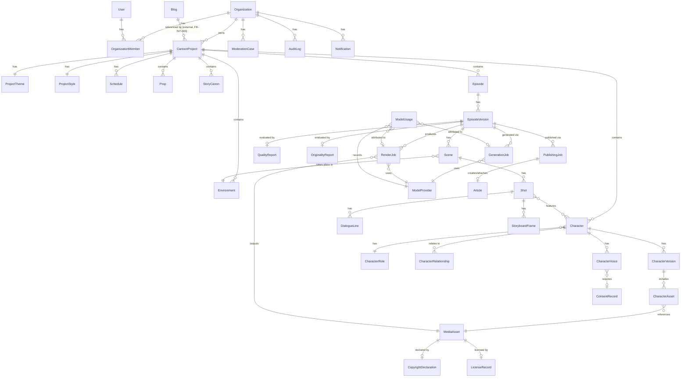

# SmarterBloggers 3D Cartoon Studio — Schéma de base de données

**Version :** 1.0 (traduction/adaptation fidèle du PRD Kimi)
**Date :** 2026-08-04
**Statut :** Document de référence — baseline pour la Phase 1
**Source faisant autorité :** `kimi.md` — NFR-DAT-001/002 (PRD §5.22)
**Dépend de :** [02_cahier_des_charges_technique.md](./02_cahier_des_charges_technique.md) §2

> Convention : toutes les tables métier portent `id` (UUID), `organization_id` (isolation tenant, RLS), `created_at`, `updated_at`. Les tables versionnées (`Character`, `Episode`) séparent l'entité « logique » (identité stable) de ses versions (`CharacterVersion`, `EpisodeVersion`) — jamais d'écrasement en place d'un contenu déjà approuvé/publié.
>
> **Fidélité à NFR-DAT-001** : la liste d'entités ci-dessous reprend exactement celle du PRD (`User`, `Organization`, `Blog`, `CartoonProject`, `ProjectTheme`, `ProjectStyle`, `Character`, `CharacterVersion`, `CharacterRole`, `CharacterRelationship`, `CharacterAsset`, `CharacterVoice`, `Environment`, `Prop`, `StoryCanon`, `Episode`, `EpisodeVersion`, `Scene`, `Shot`, `DialogueLine`, `StoryboardFrame`, `MediaAsset`, `RenderJob`, `GenerationJob`, `ModelProvider`, `ModelUsage`, `Schedule`, `PublishingJob`, `Article`, `CopyrightDeclaration`, `ConsentRecord`, `LicenseRecord`, `ModerationCase`, `QualityReport`, `OriginalityReport`, `Notification`, `AuditLog`). Une seule entité est ajoutée au-delà de cette liste littérale — `OrganizationMember` — table de jointure nécessaire pour porter les rôles/permissions par membre (NFR-SEC-001 « organization- and project-level permissions »), implicite dans le PRD mais non nommée séparément.

---

## 1. Vue d'ensemble des entités

| Domaine | Entités |
|---|---|
| Tenancy | `Organization`, `User`, `OrganizationMember` *(ajout — voir note ci-dessus)* |
| Intégration SmarterBloggers | `Blog` (référence/mirror — voir §2.1bis) |
| Projet | `CartoonProject`, `ProjectTheme`, `ProjectStyle`, `Schedule` |
| Personnages | `Character`, `CharacterVersion`, `CharacterRole`, `CharacterRelationship`, `CharacterAsset`, `CharacterVoice` |
| Univers | `Environment`, `Prop`, `StoryCanon` |
| Contenu | `Episode`, `EpisodeVersion`, `Scene`, `Shot`, `DialogueLine`, `StoryboardFrame` |
| Médias | `MediaAsset` |
| Jobs | `RenderJob`, `GenerationJob` |
| IA | `ModelProvider`, `ModelUsage` |
| Publication | `PublishingJob`, `Article` (référence côté SmarterBloggers) |
| Légal | `CopyrightDeclaration`, `ConsentRecord`, `LicenseRecord` |
| Qualité / sécurité | `ModerationCase`, `QualityReport`, `OriginalityReport` |
| Système | `Notification`, `AuditLog` |

---

## 2. Détail des entités et champs

### 2.1 Tenancy

**Organization**
`id`, `external_tenant_id` (mapping vers le tenant SmarterBloggers), `name`, `plan`, `credits_balance`, `storage_used_bytes`, `created_at`, `updated_at`, `suspended_at`

**User**
`id`, `external_user_id` (mapping vers l'utilisateur SmarterBloggers via SSO), `email`, `display_name`, `created_at`

**OrganizationMember**
`id`, `organization_id`, `user_id`, `role` (owner / admin / editor / viewer), `invited_at`, `joined_at`

### 2.1bis Intégration SmarterBloggers

**Blog** *(entité miroir, référence en lecture seule vers le blog SmarterBloggers propriétaire — reprend FR-INT-005 « reuse over rebuild » : la propriété de blog n'est jamais dupliquée/recréée côté Cartoon Studio, seulement référencée)*
`external_blog_id`, `organization_id`, `linked_at` — chaque `CartoonProject` référence un `Blog.external_blog_id` pour savoir sur quel blog SmarterBloggers ses articles seront créés/rattachés (FR-INT-003 : jamais d'UUID de blog en dur, toujours le contexte de l'utilisateur authentifié).

### 2.2 Projet

**CartoonProject**
`id`, `organization_id`, `blog_external_id` (FK logique vers `Blog.external_blog_id`, jamais en dur — FR-INT-003), `name`, `description`, `objective`, `primary_language`, `additional_languages[]`, `target_region`, `target_audience`, `audience_age_range`, `content_maturity_rating`, `preferred_episode_duration_sec`, `preferred_image_dimensions`, `preferred_platforms[]`, `generation_mode` (manual / automatic / hybrid), `consistency_thresholds` (JSONB — voir doc technique §3 AI Orchestration), `status` (draft / active / paused / archived), `created_at`, `updated_at`

**ProjectTheme**
`id`, `project_id`, `raw_input` (saisie initiale de l'utilisateur), `refined_theme` (texte final validé), `theme_category` (politique/satire, éducation finance, éducation santé, …), `specificity_score`, `ai_suggestions[]` (les ≥3 versions proposées), `accepted_suggestion_id`, `created_at`

**ProjectStyle**
`id`, `project_id`, `preset_key` (nullable si custom), `visual_style`, `realism_level`, `character_proportions`, `environment_style`, `lighting_style`, `color_palette`, `cinematic_mood`, `camera_style`, `animation_energy`, `aspect_ratio`, `resolution`, `frame_rate`, `subtitle_style`, `logo_placement`, `brand_colors[]`, `intro_outro_format`

**Schedule**
`id`, `project_id`, `frequency` (daily / weekly / custom), `time_of_day`, `timezone`, `days_of_week[]`, `content_type`, `character_ids[]`, `topic_hint`, `validation_mode` (draft_only / require_approval / auto_publish / …, voir §22 fonctionnel), `publishing_mode`, `enabled`, `next_run_at`, `last_run_at`

### 2.3 Personnages

**Character**
`id`, `project_id`, `name`, `nickname`, `role_id` (FK `CharacterRole`), `narrative_purpose`, `status` (draft / approved / archived / inactive / replacement), `current_version_id` (FK `CharacterVersion`), `created_at`, `updated_at`

**CharacterVersion**
`id`, `character_id`, `version_number`, `personality`, `speaking_style`, `typical_vocabulary`, `accent_dialect`, `apparent_age`, `gender_presentation`, `height`, `body_proportions`, `face_geometry` (JSONB), `skin_tone`, `eye_shape_color`, `eyebrows`, `nose`, `mouth`, `teeth`, `hairstyle`, `hair_color`, `facial_hair`, `distinguishing_marks`, `default_clothing`, `alt_clothing[]`, `accessories[]`, `footwear`, `posture`, `walk_style`, `typical_gestures[]`, `expression_range[]`, `emotional_tendencies`, `strengths[]`, `weaknesses[]`, `likes[]`, `dislikes[]`, `prohibited_behaviors[]`, `allowed_development_notes`, `catchphrases[]`, `character_embeddings` (vecteur), `model_file_refs[]` (FK `CharacterAsset`), `applies_to_existing_drafts` (bool, décision utilisateur à l'édition), `changed_by`, `change_summary`, `created_at`

**CharacterRole**
`id`, `project_id` (nullable si rôle built-in global), `key` (questioner / expert / comic_character / …), `label`, `is_custom`

**CharacterRelationship**
`id`, `project_id`, `character_a_id`, `character_b_id`, `relationship_type` (mentor/élève, collègues, famille, rival, …), `description`

**CharacterAsset**
`id`, `character_version_id`, `asset_type` (reference_image / 3d_model / rig / texture), `media_asset_id` (FK `MediaAsset`), `view_angle` (front / profile_left / profile_left / three_quarter / expression_happy / …), `approved` (bool), `approved_by`, `approved_at`

**CharacterVoice**
`id`, `character_id`, `provider_id` (FK `ModelProvider`), `voice_profile_ref` (identifiant côté provider), `language`, `tone`, `speed_default`, `pitch_default`, `consent_record_id` (FK `ConsentRecord`, nullable — requis uniquement si basé sur une vraie personne), `approved` (bool)

### 2.4 Univers

**Environment**
`id`, `project_id`, `name`, `description`, `visual_reference_asset_id` (FK `MediaAsset`), `recurring` (bool)

**Prop**
`id`, `project_id`, `name`, `description`, `visual_reference_asset_id` (FK `MediaAsset`), `owned_by_character_id` (nullable)

**StoryCanon**
`id`, `project_id`, `fact_type` (character_fact / relationship_fact / world_fact / topic_covered), `subject_ref` (character_id ou libre), `statement` (« Marc a 62 ans »), `established_in_episode_id`, `embedding` (vecteur, pour la recherche par similarité — voir Series Memory), `created_at`

### 2.5 Contenu

**Episode**
`id`, `project_id`, `title`, `content_type` (image / comic / video), `format_key` (Q&R, leçon, sketch, …), `status` (draft / in_review / approved / published / failed), `current_version_id` (FK `EpisodeVersion`), `generation_source` (manual / natural_language / automatic), `created_by`, `created_at`, `updated_at`, `published_at`

**EpisodeVersion**
`id`, `episode_id`, `version_number`, `script_ref` (texte structuré ou JSONB — voir Script Editor), `duration_sec`, `character_ids[]`, `location_ids[]`, `topic_summary`, `originality_report_id` (FK), `quality_report_id` (FK), `consistency_score_overall`, `consistency_score_detail` (JSONB — visage/corps/voix/rôle/…), `changed_by`, `created_at`

**Scene**
`id`, `episode_version_id`, `order_index`, `location_id` (FK `Environment`), `description`, `mood`

**Shot**
`id`, `scene_id`, `order_index`, `character_ids[]`, `camera_angle`, `camera_movement`, `composition_notes`, `action`, `emotion`, `props[]`, `lighting_notes`, `duration_sec_estimate`

**DialogueLine**
`id`, `shot_id`, `character_id` (nullable si narrateur), `text`, `emotion`, `voice_direction` (vitesse/tonalité/pause), `order_index`

**StoryboardFrame**
`id`, `shot_id`, `media_asset_id` (FK `MediaAsset` — image de storyboard), `notes`, `approved` (bool)

### 2.6 Médias

**MediaAsset**
`id`, `organization_id`, `project_id`, `owner_type` (character / environment / prop / episode / storyboard / render), `owner_id`, `asset_kind` (image / video / audio / model_3d / subtitle), `format` (PNG / MP4 / GLB / SRT / …), `storage_key`, `signed_url_ttl_default_sec`, `file_size_bytes`, `checksum`, `version_number`, `previous_version_id` (lineage), `created_at`

### 2.7 Jobs

**GenerationJob**
`id`, `organization_id`, `project_id`, `episode_id` (nullable), `job_type` (script / image / comic / storyboard / voice / lip_sync / animation / qc / fact_check / publication), `status` (pending / running / checkpointed / completed / failed / canceled), `checkpoint_stage`, `checkpoint_data` (JSONB), `provider_id` (FK `ModelProvider`), `idempotency_key`, `retry_count`, `cost_estimate`, `cost_actual`, `error_message`, `started_at`, `completed_at`

**RenderJob**
`id`, `organization_id`, `episode_version_id`, `tier` (preview / draft / standard / premium), `resolution`, `aspect_ratio`, `status`, `checkpoint_stage`, `output_media_asset_id` (FK, nullable tant que non terminé), `cost_estimate`, `cost_actual`, `queued_at`, `started_at`, `completed_at`

### 2.8 IA

**ModelProvider**
`id`, `capability` (llm / image / video / 3d / tts / stt / lip_sync / music / sfx / moderation / similarity / rendering), `provider_key`, `display_name`, `enabled`, `priority_weight`, `region`, `data_handling_policy_ref`, `health_status`, `last_health_check_at`

**ModelUsage**
`id`, `organization_id`, `project_id`, `generation_job_id` (nullable), `render_job_id` (nullable), `provider_id`, `capability`, `tokens_or_units`, `cost`, `latency_ms`, `created_at`

### 2.9 Publication

**PublishingJob**
`id`, `organization_id`, `episode_version_id`, `mode` (draft_only / require_approval / scheduled / auto_publish / …), `target` (smarterbloggers / social:<platform>), `status`, `scheduled_at`, `published_at`, `external_article_id` (référence `Article` côté SmarterBloggers), `error_message`

**Article** *(entité miroir, pas de propriété — référence en lecture seule vers l'article SmarterBloggers créé/rattaché)*
`external_article_id`, `episode_id`, `episode_version_id`, `relation_type` (created / attached), `synced_at`

### 2.10 Légal

**CopyrightDeclaration**
`id`, `organization_id`, `media_asset_id`, `declared_by`, `rights_statement`, `license_type`, `license_expiration`, `provenance`, `created_at`

**ConsentRecord**
`id`, `organization_id`, `subject_type` (voice_clone / likeness / other), `subject_description`, `consent_document_ref`, `granted_by`, `granted_at`, `revoked_at`

**LicenseRecord**
`id`, `organization_id`, `media_asset_id`, `license_source` (music_library / user_upload / ai_generated), `license_terms_ref`, `expires_at`

### 2.11 Qualité / sécurité

**ModerationCase**
`id`, `organization_id`, `subject_type` (episode_version / character / media_asset), `subject_id`, `trigger_reason` (sensitive_category / low_consistency / safety_filter / external_complaint), `status` (open / approved / rejected / escalated), `assigned_to`, `resolution_notes`, `created_at`, `resolved_at`

**QualityReport**
`id`, `episode_version_id`, `checks` (JSONB — audio normalisé, sous-titres présents, durée cohérente, …), `passed` (bool), `created_at`

**OriginalityReport**
`id`, `episode_version_id`, `similarity_findings` (JSONB), `flagged` (bool), `created_at`

### 2.12 Système

**Notification**
`id`, `organization_id`, `user_id`, `type`, `category` (generation / moderation / billing / …), `title`, `body`, `action_url`, `is_read`, `created_at`

**AuditLog**
`id`, `organization_id`, `actor_id`, `action`, `target_type`, `target_id`, `details`, `created_at`

---

## 3. ERD (diagramme entité-relation)

*(Diagramme simplifié aux relations structurantes — les FK secondaires comme `assigned_to`, `changed_by`, `created_by` pointent toutes vers `User` et sont omises du schéma pour la lisibilité.)*

---

## 4. Règles transverses du modèle de données

- **IDs immuables** : UUID générés à la création, jamais réutilisés ni recyclés.
- **Isolation tenant** : `organization_id` présent (direct ou via chaîne de FK) sur chaque table métier, avec RLS PostgreSQL activé — même pattern que SmarterBloggers.
- **Soft deletion** : `deleted_at` sur les entités utilisateur-facing (`CartoonProject`, `Character`, `Episode`) — pas de suppression physique immédiate, pour permettre restauration et audit.
- **Règles de rétention** : configurables par organisation pour les brouillons/assets non finalisés (à chiffrer en Phase 5/6, voir doc technique §26).
- **Asset lineage** : `MediaAsset.previous_version_id` chaîné pour tout asset remplacé, jamais un simple écrasement.
- **Version history** : `CharacterVersion` et `EpisodeVersion` sont **append-only** — aucune ligne existante n'est modifiée après création, seule une nouvelle version est ajoutée.
- **Migrations contrôlées** : Alembic, testées sur environnement de dev avant application en production (même discipline que le backend SmarterBloggers existant).
